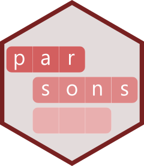
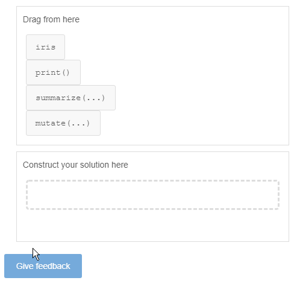

<!-- README.md is generated from README.Rmd. Please edit that file -->

```{r, include = FALSE}
knitr::opts_chunk$set(
  collapse = TRUE,
  comment = "#>",
  fig.path = "man/figures/README-",
  out.width = "100%"
)
```

# parsons 


<!-- badges: start -->
[](https://travis-ci.org/rstudio/parsons)
[](https://cran.r-project.org/package=parsons)
[](http://www.rpackages.io/package/parsons)
[](https://codecov.io/gh/rstudio/parsons?branch=master)
[](https://www.tidyverse.org/lifecycle/#experimental)
<!-- badges: end -->


Use the `parsons` package to create Parsons problems for teaching progamming. You can create custom questions in your `learnr` tutorials.


## Installation

~~You can install the released version of parsons from [CRAN](https://CRAN.R-project.org) with:~~

```r
~~install.packages("parsons")~~
```

And the development version from [GitHub](https://github.com/rstudio/parsons) with:

```r
# install.packages("remotes")
remotes::install_github("rstudio/parsons")
```

## Examples


### Parsons problems

A Parsons problem is a specific type of question, useful for teaching programming, where all the lines of code are given, but the student must provide the correct order.

The `parsons()` function has experimental support for parsons problems.


```{r echo=FALSE, cache=FALSE}
knitr::read_chunk(
  system.file("shiny-examples/parsons_app.R", package = "parsons")
)
```

```{r parsons-app, eval=FALSE}
```

<center>
</img>
</center>
